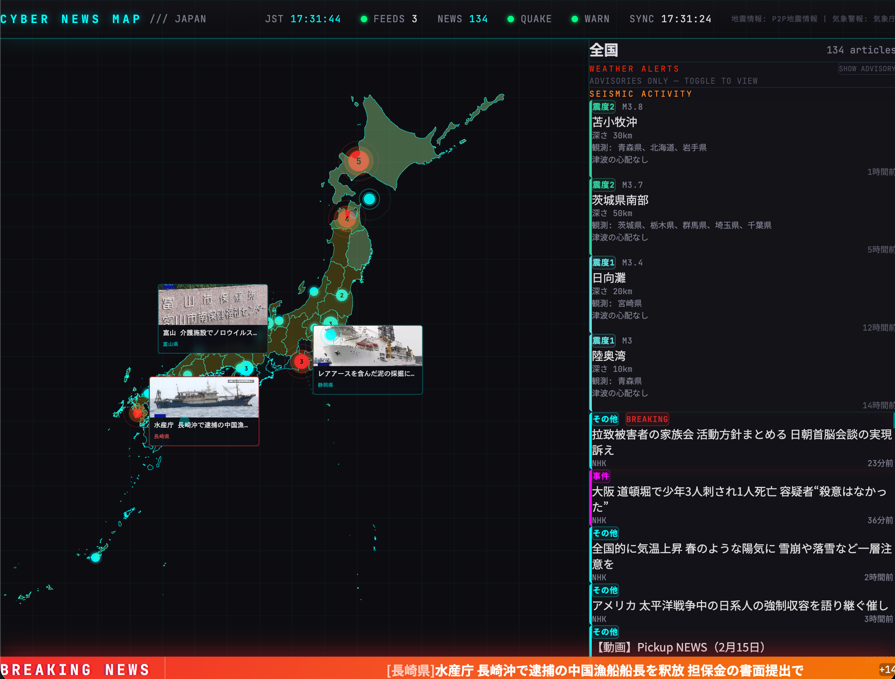

# 🗾 Cyber Japanese News

サイバーパンク風のUIで日本のニュースと気象情報をリアルタイム表示するWebアプリケーション。



## ✨ 機能

### ニュース表示
- NHK RSSフィードから最新ニュースを取得・表示
- 日本地図上にニュースをマーカー表示
- 都道府県ごとにニュースをフィルタリング
- 速報ニュースは赤いパルスエフェクトで強調

### 地震・津波情報
- P2P Quake APIから過去24時間の地震情報を取得
- 震源地を地図上にマーカー表示
- 震度に応じた色分け表示
- 津波情報（注意報・警報）のバナー表示

### 気象警報
- 気象庁から気象警報・注意報を取得
- 地図上に警報エリアをオーバーレイ表示

### サイバーパンク風UI
- グリッド背景・スキャンライン効果
- グリッチテキストアニメーション
- 速報時の画面シェイクエフェクト
- ネオンカラー（シアン系）のデザイン

## 🛠 技術スタック

### Frontend
- **React 19** - UIライブラリ
- **Vite** - ビルドツール（Next.jsは使用せず、軽量なSPA構成）
- **TypeScript** - 型安全な開発
- **Tailwind CSS v4** - スタイリング
- **D3.js** - 地図描画・データ可視化
- **TopoJSON** - 日本地図データ処理
- **Framer Motion** - アニメーション

### Backend
- **Cloudflare Workers** - サーバーレスEdge環境
- **Wrangler** - Cloudflare Workers CLI
- **fast-xml-parser** - XML（RSS）パーサー

### データソース
- **NHK RSS** - ニュース記事
- **P2P Quake API** - 地震・津波情報
- **気象庁** - 気象警報

## 📁 プロジェクト構成

```
cyber-news-app/
├── package.json              # pnpmワークスペースのルート設定
├── pnpm-workspace.yaml       # pnpmモノレポ設定
├── docs/
│   └── screenshot.png        # スクリーンショット
│
├── frontend/                 # React フロントエンド
│   ├── src/
│   │   ├── App.tsx           # メインコンポーネント
│   │   ├── main.tsx          # エントリーポイント
│   │   ├── index.css         # グローバルスタイル
│   │   ├── components/       # UIコンポーネント
│   │   │   ├── JapanMap.tsx       # 地図コンポーネント（D3.js）
│   │   │   ├── NewsSidePanel.tsx  # ニュース一覧パネル
│   │   │   ├── StatsBar.tsx       # ステータスバー
│   │   │   ├── BreakingBanner.tsx # 速報バナー
│   │   │   ├── TsunamiBanner.tsx  # 津波バナー
│   │   │   ├── WarningBanner.tsx  # 警報バナー
│   │   │   ├── GridBackground.tsx # グリッド背景
│   │   │   ├── ScanlineOverlay.tsx# スキャンライン効果
│   │   │   ├── GlitchText.tsx     # グリッチテキスト
│   │   │   ├── EpicenterMarker.tsx# 震源地マーカー
│   │   │   ├── SeismicOverlay.tsx # 震度分布オーバーレイ
│   │   │   ├── WarningOverlay.tsx # 警報エリアオーバーレイ
│   │   │   ├── OgpCardLayer.tsx   # OGPカード表示
│   │   │   ├── ZoomControls.tsx   # ズームコントロール
│   │   │   └── effects/           # エフェクトコンポーネント
│   │   │       ├── EffectLayer.tsx
│   │   │       ├── IncomingPulse.tsx    # Lv.1 新着エフェクト
│   │   │       ├── AlertRipple.tsx      # Lv.2 警戒エフェクト
│   │   │       └── CriticalShockwave.tsx# Lv.3 緊急エフェクト
│   │   ├── hooks/            # カスタムフック
│   │   │   ├── useNewsData.ts      # ニュース取得
│   │   │   ├── useJmaData.ts       # 気象データ取得
│   │   │   ├── useBreakingDetection.ts # 速報検出
│   │   │   ├── useUpdateDetection.ts    # 更新イベント検出
│   │   │   └── useMapZoom.ts       # 地図ズーム管理
│   │   ├── lib/              # ユーティリティ
│   │   │   ├── prefectures.ts      # 都道府県データ
│   │   │   ├── seismicScale.ts     # 震度スケール
│   │   │   ├── breakingKeywords.ts # 速報キーワード
│   │   │   ├── warningCodes.ts     # 警報コード
│   │   │   └── mock*.ts            # モックデータ
│   │   └── types/            # TypeScript型定義
│   │       ├── news.ts
│   │       ├── jma.ts
│   │       └── effects.ts
│   ├── public/
│   │   └── japan-topo.json   # 日本地図TopoJSON
│   ├── index.html
│   ├── vite.config.ts
│   └── package.json
│
└── worker/                   # Cloudflare Workers バックエンド
    ├── src/
    │   ├── index.ts          # Workerエントリーポイント
    │   ├── rss-fetcher.ts    # NHK RSS取得・パース
    │   ├── jma-fetcher.ts    # 地震・津波データ取得
    │   ├── warning-fetcher.ts# 気象警報取得
    │   ├── ogp-fetcher.ts    # OGP情報取得
    │   ├── region-classifier.ts # 地域分類
    │   ├── area-code-map.ts  # 地域コードマッピング
    │   ├── warning-codes.ts  # 警報コード定義
    │   └── types.ts          # 型定義
    ├── wrangler.toml         # Wrangler設定
    └── package.json
```

## 🚀 実行方法

### 前提条件
- Node.js 18+
- pnpm

### インストール

```bash
pnpm install
```

### 開発サーバー起動

```bash
pnpm dev
```

以下のサーバーが同時に起動します：
- **Frontend**: http://localhost:5173
- **Worker API**: http://localhost:8787

### ビルド

```bash
pnpm build
```

### デプロイ

本番デプロイには Cloudflare アカウントが必要です：

```bash
# Cloudflare認証
wrangler login

# デプロイ
pnpm run --filter ./worker deploy
```

## 💡 Cloudflare アカウントについて

| 環境 | アカウント | 動作場所 |
|------|-----------|----------|
| `pnpm dev` | **不要** | ローカルマシン |
| `wrangler dev` | **不要** | ローカルマシン |
| `wrangler deploy` | **必要** | Cloudflare Edge |

ローカル開発環境では `wrangler dev` がローカルシミュレーターを使用するため、Cloudflareアカウントなしで完全に動作します。

## 🎮 開発者向け機能

開発モードではキーボードショートカットでエフェクトをテストできます：

- **キー 1**: Lv.1 incoming エフェクト（新着ニュース）
- **キー 2**: Lv.2 alert エフェクト（中程度の地震）
- **キー 3**: Lv.3 critical エフェクト（大きな地震・画面シェイク付き）

## 🔄 データフロー

```
┌─────────────────────────────────────────────────────────────┐
│                    データソース                              │
├─────────────────────────────────────────────────────────────┤
│  NHK RSS (5カテゴリ)  │  P2P Quake API  │  気象庁警報XML   │
└──────────┬───────────┴────────┬─────────┴────────┬─────────┘
           │                    │                  │
           ▼                    ▼                  ▼
┌─────────────────────────────────────────────────────────────┐
│              Cloudflare Workers (worker/)                    │
│                                                              │
│         /api/news            /api/jma                        │
└─────────────────────────────────────────────────────────────┘
                          │
                          ▼
┌─────────────────────────────────────────────────────────────┐
│                React Frontend (frontend/)                    │
│                                                              │
│  ┌─────────┐ ┌─────────┐ ┌─────────┐ ┌───────────────────┐  │
│  │JapanMap │ │SidePanel│ │ Banners │ │    Effects        │  │
│  └─────────┘ └─────────┘ └─────────┘ └───────────────────┘  │
└─────────────────────────────────────────────────────────────┘
```

## 📝 設定

### 環境変数（Frontend）

```env
VITE_USE_MOCK=true    # モックデータを使用（開発用）
VITE_API_URL=http://localhost:8787  # Worker APIのURL
```

## 📄 ライセンス

このプロジェクトはオリジナルをベースにして個人のコーディング学習用として作成しています：
- オリジナル: https://github.com/kiakiraki/cyber-japanese-news